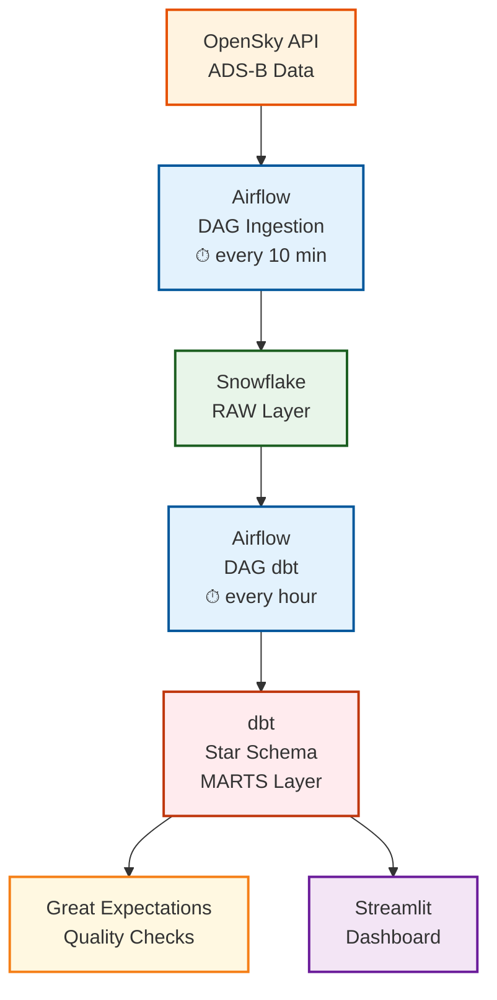

# ✈️ Flight Tracking — Near Real-Time Pipeline

## Overview

This project is an end-to-end data engineering pipeline that collects, processes, and analyzes **live aircraft positions over France** from the **OpenSky Network API**. It demonstrates how to build a pipeline with:

- Near real-time ADS-B data ingestion every 10 minutes
- Workflow orchestration with Apache Airflow (two independent DAGs)
- Data warehousing in Snowflake (RAW layer)
- ELT transformation & automated testing with dbt (star schema)
- Layered data quality checks with Great Expectations

---

## Architecture



---

## Data Pipeline

### 1. Data Collection – OpenSky Network API
- Fetches live aircraft positions over **metropolitan France** every 10 minutes
- OAuth2 authentication with automatic token renewal and retry logic
- SHA256-based deduplication key generated per position

### 2. Data Loading – Snowflake (RAW Layer)
- Loads positions via a **MERGE INTO** pattern — fully idempotent, zero duplicates
- Returns ingestion stats: inserted, skipped, total

### 3. Data Quality – Great Expectations (RAW)
- Validates raw positions: non-null coordinates, valid ranges
- Non-blocking — logs warnings but never stops the pipeline

### 4. Data Transformation – dbt (ELT)
- **Staging** → cleans and standardizes raw positions
- **Intermediate** → deduplication logic
- **Marts** → analytics-ready star schema
- Automated dbt tests and source freshness checks on every run

### 5. Data Quality – Great Expectations (MARTS)
- Validates analytical tables against quality contracts
- Blocking — pipeline stops if checks fail

---

## Analytics Layer (dbt Models)

### dbt Lineage Graph

[](https://postimg.cc/1nLnRsdD)

### Staging – `stg_positions`
Cleans and standardizes raw ADS-B data:
- Unique position ID validation
- Non-null checks on icao24, latitude, longitude, timestamp
- Speed and altitude range validation

### Intermediate – `int_positions_deduped`
Deduplication layer before marts:
- Removes duplicate positions based on SHA256 key
- Ensures clean input for analytical models

### Marts

#### `fact_positions`
All aircraft position points over France:
- Coordinates (latitude, longitude)
- Altitude (barometric and geometric)
- Speed, heading, climb rate
- Timestamp and flight reference

#### `dim_vols`
Flight dimension:
- ICAO24 unique identifier
- Callsign and origin country
- Flight metadata

---

## Business Insights

This pipeline enables answering questions such as:
- How many aircraft are flying over France at any given moment?
- What are the most active flight corridors over French territory?
- Which countries generate the most air traffic over France?
- How does traffic volume evolve throughout the day and week?

---
## Dashboard
 
An interactive **Streamlit** dashboard provides near real-time monitoring of aircraft over France:
 
- **Live KPIs** — number of aircraft in flight, active airlines, average altitude and speed, active anomalies
- **Interactive map** — aircraft positions with heading, altitude, speed and flight phase, color-coded by phase
- **Anomaly detection** — flags aircraft with suspicious altitude variation (mismatch between computed and reported climb rate)
---

### 1. Configure Airflow Variables

In the Airflow UI (`Admin → Variables`), add:

```
OPENSKY_CLIENT_ID=your_opensky_client_id
OPENSKY_CLIENT_SECRET=your_opensky_client_secret
```

### 2. Configure Airflow Connection

Create a connection named `FT_snowflake_default` with:

| Field | Value |
|-------|-------|
| Conn Type | Snowflake |
| Host | your Snowflake account |
| Login | your Snowflake username |
| Password | your Snowflake password |
| Extra (JSON) | `{"database": "FLIGHT_TRACKING", "schema": "RAW", "warehouse": "COMPUTE_WH", "role": "ACCOUNTADMIN"}` |

### 3. Run the DAGs

- Activate `dag_ingest_flights` → runs every **10 minutes**
- Activate `dag_dbt_transform_main` → runs every **hour**

### 4. Run the dashboard

Create a `.env` file in the streamlit folder with your Snowflake credentials:
 
```
SNOWFLAKE_USER=your_user
SNOWFLAKE_PASSWORD=your_password
SNOWFLAKE_ACCOUNT=your_account
SNOWFLAKE_DATABASE=FLIGHT_TRACKING
SNOWFLAKE_WAREHOUSE=COMPUTE_WH
SNOWFLAKE_ROLE=ACCOUNTADMIN
```
Install the requirements and run the dashboard
```bash
pip install -r requirements.txt
streamlit run dashboard.py
```

---

## Results

### Airflow DAGS
[](https://postimg.cc/ZBynMXq5)
[](https://postimg.cc/XpgJmfn3)

### Snowflake Tables
[](https://postimg.cc/B8m7VwVR)
[](https://postimg.cc/47n2kbDW)
[](https://postimg.cc/JDtYVcfd)

### Streamlit Dashboard 
[Watch Demo](https://github.com/user-attachments/assets/f0ed8859-9416-4977-9b7a-a074a2f693cf)
